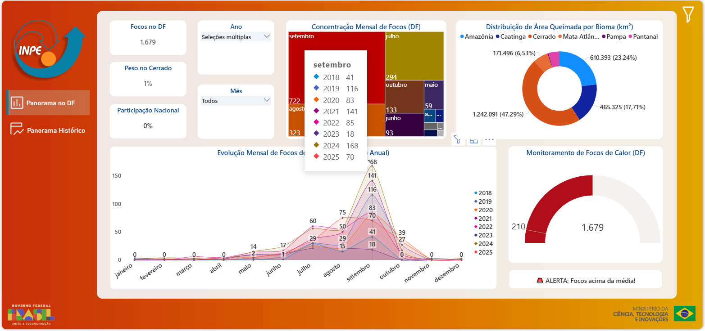
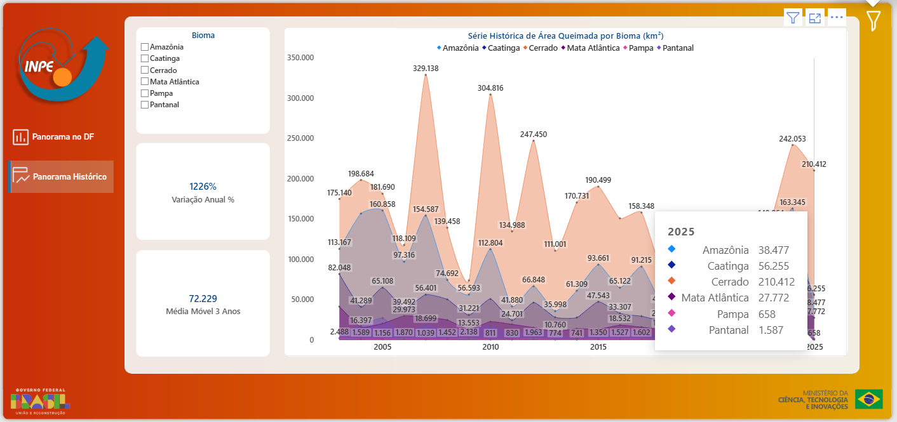

# 📊 Sistema de Monitorização de Queimadas no Distrito Federal (DF)

## 📝 Sobre o Projeto
Este repositório armazena o projeto de extensão universitária do bacharelato em Engenharia de Software, criado para democratizar o acesso à informação ambiental. Desenvolvido para a comunidade local e académica, o painel interativo permite estudar, de forma simples e visual, a evolução e o risco dos focos de calor no bioma Cerrado e no Distrito Federal.

A ferramenta recolhe a série histórica de dados abertos do INPE (Instituto Nacional de Pesquisas Espaciais) e transforma-a em inteligência visual, apoiando pesquisas, trabalhos académicos e a consciencialização sobre as alterações climáticas e o impacto das queimadas.

---

## 📂 Estrutura do Repositório
Para facilitar a navegação e a auditoria do projeto, os ativos estão organizados da seguinte forma:
* `code/`: Documentação e scripts de tratamento de dados (Linguagem M).
* `dashboard/`: Diretório contendo o ficheiro executável do painel interativo (`.pbix`).
* `data/`: Base de dados local (ficheiros CSV) processada a partir da série histórica.
* `images/`: Capturas de ecrã da interface validada e diagramas de modelação.

---

## 📸 Conheça a Interface e a Modelação
Abaixo estão os ecrãs principais do painel interativo e a modelação lógica (Casos de Uso) que sustenta o projeto.

### Panorama Macro e Alertas

*Figura 1: Panorama focado no Distrito Federal. A interface permite que o utilizador filtre dados por ano e mês, acompanhando a evolução dos focos de calor ao longo do tempo e identificando períodos de alerta.*

### Análise Histórica e Biomas

*Figura 2: Análise histórica comparativa. Este ecrã demonstra o impacto das queimadas em diferentes biomas brasileiros, destacando o peso das ocorrências no Cerrado.*

### Casos de Uso (UML)

*Figura 3: Diagrama de Casos de Uso (UML). Ilustra como a comunidade académica interage com as funcionalidades visuais, enquanto a manutenção, auditoria dos dados locais e verificação de consistência ocorrem sob a gestão da administração de dados.*

---

## ⚙️ Como Descarregar e Utilizar o Painel
Para garantir a segurança e a integridade do grande volume de dados históricos, o sistema foi projetado para ser executado localmente. Siga os passos abaixo para aceder:

1. **Instale o Software Base:** Aceda ao site oficial e instale gratuitamente o [Microsoft Power BI Desktop](https://powerbi.microsoft.com/desktop/).
2. **Descarregue o Projeto:** Clique diretamente neste link: **[Monitoramento_Queimadas_DF.pbix](dashboard/Monitoramento_Queimadas_DF.pbix)**. Na página que se abrir, clique no ícone de **"Download raw file"** (um botão com uma seta a apontar para baixo, localizado no lado direito do ecrã).
3. **Explore os Dados:** Abra o ficheiro descarregado no seu computador. Terá acesso total à ferramenta, podendo interagir com os filtros, cruzar informações e utilizar o sistema para os seus estudos ambientais.

---

## 🏗️ Estrutura Técnica
A arquitetura de dados foi desenhada priorizando a performance analítica sem dependência de servidores externos (contornando restrições de *deploy* web):
* **Fontes de Dados:** Ingestão otimizada de ficheiros locais (CSV) originados do portal BDQueimadas.
* **Processamento (ETL):** Limpeza, tratamento de nulos e normalização executados no Power Query através da Linguagem M.
* **Armazenamento e Performance:** Compressão de dados gerida pelo motor interno VertiPaq.
* **Modelação Semântica:** Estrutura multidimensional em *Star Schema*, com métricas temporais desenvolvidas em linguagem DAX.
